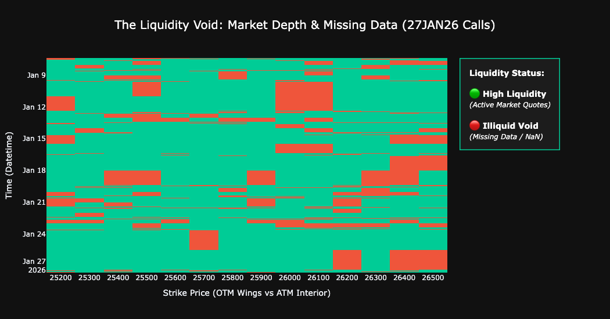
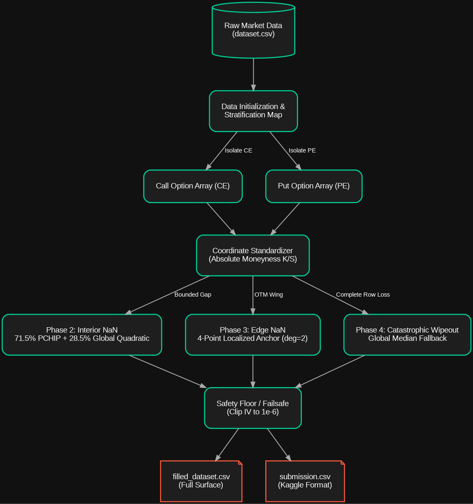
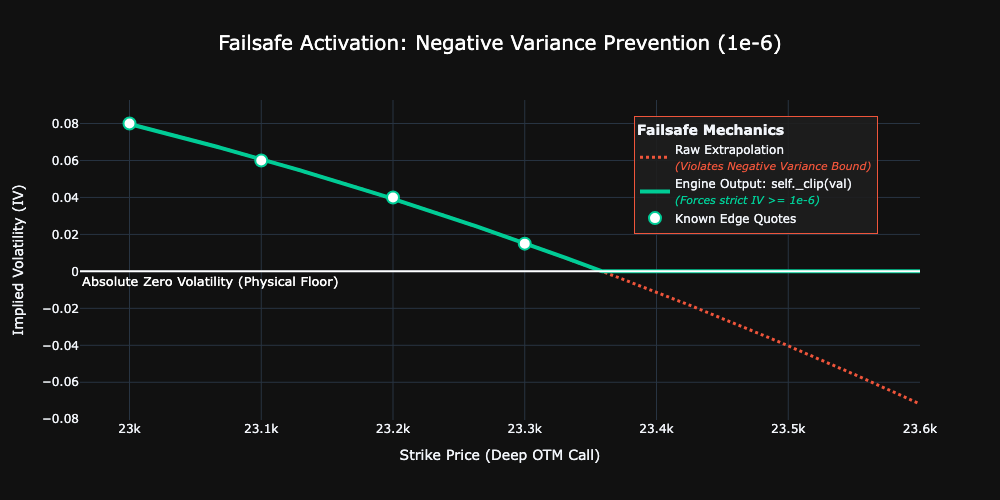
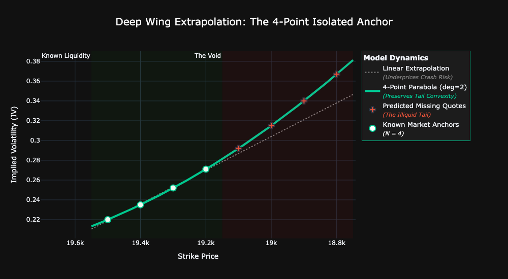
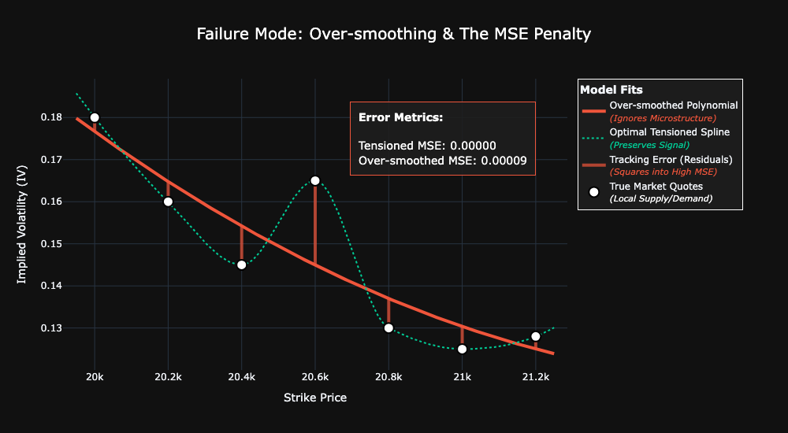
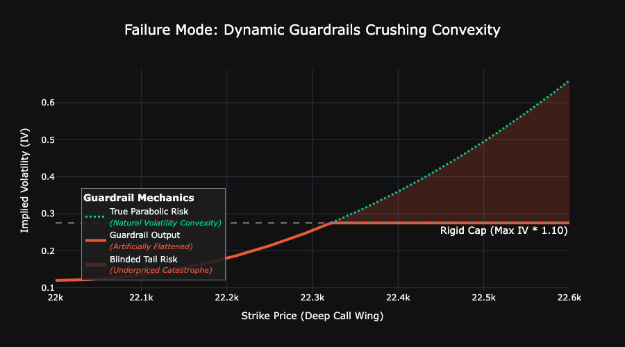
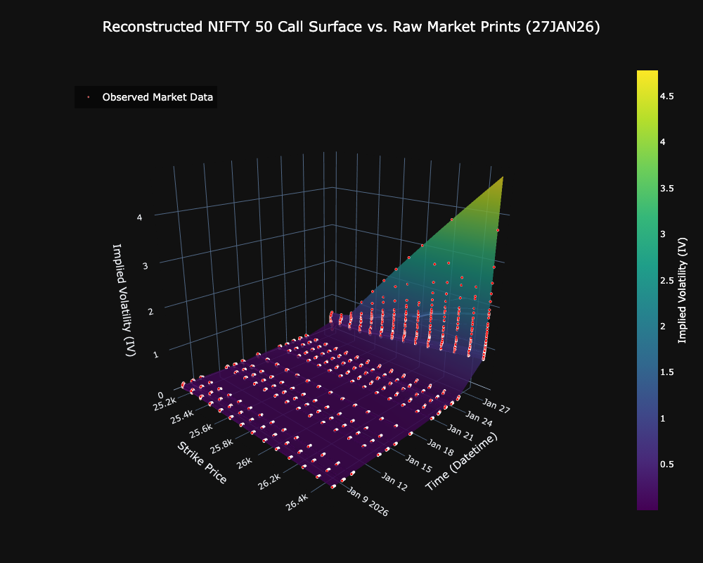

# NIFTY Options Implied Volatility Surface Reconstruction

If you are new to quantitative finance, it helps to think of the options market as an "insurance" market for stocks.

When you buy an option, you are buying the right to buy or sell a stock at a **specific price (the Strike Price)** on a **specific date (the Expiry)**. Just like house insurance gets more expensive when a hurricane is approaching, options get more expensive when the market expects turbulence.

This expectation of future turbulence is called **Implied Volatility (IV)**.
- **The Volatility Smile**: If you plot the IV of all options for a specific expiry, it doesn't form a flat line. It forms a curve that looks like a "smile" or a "smirk." 

- **The Problem**: The market is not perfect. For extremely safe or extremely risky strike prices, there is often no trading volume. The quotes disappear, leaving massive "holes" (NaN values) in the data.

- **The Objective**: This project aims to mathematically predict those missing holes to reconstruct the true, complete NIFTY 50 options surface. We cannot just draw a straight line between points, we must respect the natural, parabolic curvature of the volatility smile.

# Table Of Contents

- [1. Project Pipeline](#1-project-pipeline)
- [2. System Architecture](#2-system-architecture)
- [3. Core Methodology](#3-core-methodology)
    - [3.1 Data Initialization & Stratification](#31-data-initialization--stratification)
    - [3.2 The Safety Floor](#32-the-safety-floor)
    - [3,3 The Mathematical Solvers](#33-the-mathematical-solvers)
    - [3.4 The Core Engine Loop](#34-the-core-engine-loop)
- [4. Experimental Iterations](#4-experimental-iterations)
- [5. Final Results](#5-final-results)
- [6. Potential Improvements](#6-potential-improvements)
- [7. References](#7-references)

# 1. Project Pipeline

In this section, I will explain the exact files involved:
```text
dataset.csv
final.py
submission.csv
filled_dataset.csv
```
and how the data flows through them.
1. `dataset.csv` **(The Input)**:\
The raw market data containing underlying prices, timestamps, and the options chain. This file contains the missing Implied Volatility (IV)   values that need to be predicted.
2. `final.py` **(The Engine)**:\
The main Python script containing the `VolatilityReconstructor` class and the execution pipeline. It iterates through the dataset row-by-row, isolates the missing points, and applies the constructive curve-fitting math to calculate the predicted missing volatility.
3. `filled_dataset.csv` & `submission.csv` **(The Outputs)**:\
Once the execution is complete, the engine generates two distinct output files:
- `filled_dataset.csv` **(Full Surface Data)**: The complete, fully reconstructed NIFTY options dataset. This allows for local inspection of the full volatility surface to verify the structural integrity of the predictions across all strikes and expiries.
- `submission.csv` **(Kaggle Format)**: The official competition output. The code automatically extracts only the previously missing values, formats them into the required `datetime||strike` IDs, and generates this file ready for Kaggle evaluation.

# 2. System Architecture

The codebase is built around a single, highly optimized Custom Cross-Sectional Curve-Fitting imputer class (`VolatilityReconstructor`). Instead of relying on heavy ML models that overfit, or time-series moving averages that lag the market, this architecture was designed with three strict principles:
1. **Cross-Sectional Isolation (Row-by-Row Processing)**:\
The model processes the dataset cross-sectionally. It isolates a single timestamp, extracts all known implied volatilities for that exact minute, and processes the curve independently. By completely ignoring past and future timestamps, the model guarantees zero temporal leakage and avoids the lagging effect of time-series smoothing.

2. **Coordinate Standardization (Absolute Moneyness)**:\
Rather than plotting the options chain on an arbitrary X-axis of raw strike prices directly, the architecture structurally projects the data into a normalized coordinate plane. Every strike is dynamically converted into Absolute Moneyness ($K/S$) before being passed to the engine.

3. **Zonal Partitioning**:\
The surface is structurally partitioned into two distinct zones - the Interior and the Edge. The model dynamically identifies whether a missing data point is bounded by known market data on both sides or on the the deep out-of-the-money wings. Depending on that, the point is automatically routed to the appropriate mathematical solver (detailed in the next section).

# 3. Core Methodology

Before diving into the depth of ideas, all good researchers first analyse their dataset.
To build an optimal, deterministic curve-fitting engine, I first performed a rigorous micro-structural profile of the missing data (NaNs) in the options chain.\

**The Empirical Missing Data Profile:**

**Total Missing Data**: Exactly `5,460` cells are missing out of `27,300` (20.00% of the entire surface).\
**Interior NaNs** (`4,491 cells`): These are "holes" bounded by known market quotes on both sides. Roughly 82.25% of the missing cells.\
**Edge NaNs** (`969 cells`): These are deep Out-of-the-Money (OTM) strikes on the wings of the smile where liquidity completely decays. Roughly 17.75% of the missing cells.



Because the mathematical environment of an "Interior" hole is fundamentally different from an "Edge" wing, the engine isolates them and solves them using separate techniques. Here is the exhaustive breakdown of the mathematical functions driving the code, and the reasoning behind why they were designed this way.



## 3.1 Data Initialization & Stratification
Before any math is applied, the options chain must be parsed. The easiest way to do this in Python is to just iterate over the whole dataframe. I did not do that.

Instead, the `_initialize_data` function uses Regex (`re.search`) to dynamically identify expiries and strictly separate Call (CE) arrays from Put (PE) arrays, storing them in a `chain_map`. 

**Reasoning:** Calls and Puts are two entirely different behavioral universes. Puts represent fear (downside protection) and are inherently more expensive and skewed than Calls. If you feed an entire options chain into a single polynomial, the massive, illiquid skew of the Put wing will mathematically cross-contaminate the smooth, liquid Call wing. By strictly stratifying the data into isolated CE and PE arrays, we guarantee that the math for a Call is never affected or influenced by the fear premium of a Put.

## 3.2 The Safety Floor
```python
def _clip(self, v):
    return max(float(v), self.fallback_vol) if np.isfinite(v) else np.nan
```
Every single prediction made by the engine is forced through this 2-line function before being saved. It enforces a strict physical lower bound of `1e-6`. 

**Reasoning:** A quadratic polynomial doesn't know it's pricing a financial instrument — it's just drawing a line. If an extrapolated wing curves downward, a parabola will happily predict an Implied Volatility of -0.05. In quantitative finance, negative volatility is a lethal anomaly. If you feed $IV \le 0$ into a Black-Scholes pricer, it will lead to `DivisionByZero` error. I built `_clip` as a fail-safe to guarantee downstream pricing integrity, no matter how wild the parabola gets.



## 3.3 The Mathematical Solvers
As mentioned before, it was imperative that we handled the interior and edge cells separately, for this I built two distinct specialized curve-fitting functions.

**1. The Local Tangent (PCHIP Interpolation)**
```python
val = pchip_interpolate(x_clean, y_clean, target_x)
```
Initially, it is attractive to use the standard `scipy.interpolate.CubicSpline`. I tried it. The problem is that standard splines enforce continuous second derivatives — meaning they are obsessed with making the curve look perfectly smooth. If IV drops sharply between two strikes, a standard spline will mathematically "wiggle" to connect the dots, creating an artificial bulge. In finance, a wiggle is a fake arbitrage opportunity.

**Reasoning:** I chose **PCHIP (Piecewise Cubic Hermite Interpolating Polynomial)** because it enforces strict monotonicity. If the market data is sloping downwards, the PCHIP curve is mathematically forbidden from artificially curving upwards inside the gap. In a way, it respects the directionality of the market.

>PCHIP crashes if x-coordinates aren't strictly increasing, so I included the `u_x, indices = np.unique...` block to seamlessly average out any duplicate, dirty timestamps on the fly.

**2. The Macro Gravity: (Global Quadratic Fit)**
```python
deg = 1 if len(y_arr) == 2 else 2
coefs = np.polyfit(x_arr, y_arr, deg)
```
Why did we strictly lock the global solver to a parabola (`deg=2`) instead of letting it flex with a higher-order polynomial? During testing, using higher degrees caused the Mean Squared Error (MSE) to violently explode. This wasn't standard "overfitting" — it was a structural violation of quantitative finance.

**Reasoning:** 
- A cubic equation ($ax^3 + bx^2 + cx + d$) fundamentally has asymmetric tails. As $x \to \infty$, it curves up, but as $x \to -\infty$, it violently curves down. A volatility smile requires both wings to slope upwards. If you fit a cubic curve to an options chain, it will mathematically force one of the wings to plunge straight down into negative volatility. We call this: **Asymptotic Collapse**
- A quartic equation can curve upwards on both sides, but it introduces up to three turning points (creating a "W" shape instead of a "U" shape). In options pricing, if the IV curve forms a "W", the second derivative becomes negative. This implies a negative probability density function, which creates a **Butterfly Arbitrage** (meaning you could theoretically gain risk-free profit).

However, a parabola guarantees exactly one global minimum (the vertex) and strictly positive convexity ($U$-shape). It is the only polynomial that physically respects the no-arbitrage boundaries of the volatility surface.

Also notice how I explicitly handled an edge-case: `deg = 1 if len(y_arr) == 2`. If a massive data wipeout leaves only 2 known points on a wing, attempting to fit a 3-variable parabola ($ax^2 + bx + c$) will cause an underdetermined matrix crash. So we step down to a linear straight line (`deg=1`) to mathematically survive the missing data without breaking the loop.

## 3.4 The Core Engine Loop
The `process_surface` function is the heartbeat of this project. It iterates through the dataset strictly row-by-row, ensuring absolute cross-sectional isolation (zero temporal leakage). When a row with missing data is identified, it follows a rigorous, four-phase mathematical pipeline.

**Phase 1: Coordinate Projection (Absolute Moneyness)**

I used the explicit coordinate projection: $M = \frac{K}{S}$. By standardizing the coordinate space to Absolute Moneyness, $M = 1.00$ is always perfectly At-The-Money (ATM), no matter what time of day it is. This transformation acts as a universal anchor, allowing the polynomials to accurately evaluate the curvature of the smile seamlessly across all timestamps.

**Reasoning:** I first fed the engine raw strike prices as the x-axis. The MSE was highly unstable. I realized that the underlying NIFTY index ($S$) is a moving target. A polynomial fitted to raw strikes will fail because the mathematical vertex of the curve is constantly moving.

**Phase 2: Filling the Interior**
```python
val = (self.quad_weight * q_pred) + (self.pchip_weight * p_pred)
```
When a missing cell is bounded by known data on both sides, it enters the interior solver. To calculate the missing value, we engineered a dynamically weighted hybrid model. The engine computes two separate predictions:

- **A Local Tangent**: Calculated using PCHIP interpolation, which focuses strictly on the immediate neighboring strikes and enforces monotonicity.
- **A Macro Anchor**: Calculated using a Global Quadratic polynomial (`deg=2`), which evaluates all 14 points on the entire options chain simultaneously.

We then linearly combine these two predictions. The weights are strictly locked at **71.5%** for PCHIP and **28.5%** for the Global Quadratic.

**Reasoning:** Our data profiling showed that **96.6%** of these interior gaps were microscopic 1 or 2-strike holes.
- Because the gaps are so small, PCHIP operates as a highly accurate local tangent. However, using 100% PCHIP makes the model too sensitive to localized market noise. The curve ends up hugging dirty data points too tightly, resulting in artificial spikes.
- The Global Parabola acts as a mathematical shock-absorber. Because it evaluates the entire options chain, it ignores localized noise and maps the fundamental baseline of the market.
- Why the empirical ratio of 71.5/28.5? This was something I figured out through rigorous testing, initially the 75/25 split seemed optimal but through many trials I discovered that the **71.5%** weight is just strong enough to strictly preserve the localized pricing tangent, while the **28.5%** macro-anchor applies a sufficient amount of tension necessary to smooth out local noise. Is this optimal though? Probably not. I believe the perfect ratio is different (albeit probably slightly), I just honestly was unable to find a technique and write the code to discover it.

**Phase 3: Filling the Edges**
```python
anchor_x = known_x[:self.anchor_points] # We strictly slice the 4 nearest points
```
When a missing point falls outside the known boundaries of the options chain (the deep wings), it enters the edge solver. To calculate this extrapolated value, we completely abandon the global options chain. Instead, we dynamically slice the dataset to isolate strictly the 4 nearest known market points adjacent to the missing wing. We fit an independent, localized parabola (deg=2) exclusively to these 4 anchor points and project its specific trajectory outward into the deep Out-of-the-Money (OTM) territory.

**Reasoning:**\
Why exactly 4 points? We needed localized isolation, but we also needed statistical safety.
- Two points form a linear straight line. Extrapolating risk with a straight line completely ignores options convexity.
- On the other hand, a 3-point parabola has zero degrees of freedom. If just one of those 3 market points is corrupted by a bad bid-ask spread, the math has no ability to correct itself, and the projected wing whips violently off the chart.
- Four points act as the golden threshold. It provides exactly enough degrees of freedom to mathematically average out a single anomalous market print, while keeping the regression tightly clustered on the extreme edge of the smile.



**Phase 4: The Global Median Safety Net**
```python
self.filled_df.at[r_idx, m_col] = self._clip(val) if np.isfinite(val) else self.g_median
```
When the mathematical solvers encounter a state where calculation is structurally impossible (resulting in an unhandled np.nan or infinity), the engine completely bypasses the polynomials. Instead, it conditionally injects the global median implied volatility (self.g_median) of the entire active dataset. This median value is calculated exactly once during object initialization and serves as a strict, deterministic safety floor for the entire options chain.

**Reasoning:**\
We can't use forward-filling from previous timestamps as that introduces temporal leakage. Neither can we fill the values with `0.0` as pricing models like Black-Scholes require devision by volatility ($\sigma \sqrt{t}$). An Implied Volatility of `0.0` causes DivisionByZero error.
However, the global median provides a mathematically safe, non-zero macro baseline. It is immune to extreme outliers unlike the _mean_ and requires no look-ahead bias.\
Statistically too, it does minimize our MSE as falling back to the absolute center of the dataset guarantees that you will minimize the maximum possible error penalty.

# 4. Experimental Iterations
In quantitative finance (or any field for that matter), proving what _failed_ is just as important as proving what _succeeded_. In this section, I deep-dive into failed ideas or strategies that I tried out but did not yield significant returns.

## Total Variance Space ($IV^2$) & Log-Moneyness ($$\ln(K/S)$$)
**What I tried:**\
In professional volatility surface construction (like the SVI model), interpolation is rarely done on raw volatility ($\sigma$). Instead, we attempted to map the dataset into Total Variance space ($\sigma^2$) using log-moneyness ($$\ln(K/S)$$). The theory was that squaring the volatility would smooth the data and prevent butterfly arbitrage, while log-space would create a more symmetric smile.

**Output and why I think it didn't work:**\
Mean Squared Error (MSE) worsened by roughly 5%. While this transformation is standard for highly symmetric indices like the S&P 500, the Indian NIFTY 50 exhibits an extreme, asymmetric "Put Skew" driven by downside tail-risk hedging. Log-moneyness forced an artificial symmetry onto the data, while Variance Space mathematically flattened the curvature of the deep wings. Together, they systematically underpriced the deep OTM risk premium.

## Overdetermined Edge Anchors ($N = 6$ or $8$)
**What I tried:**\
If 4 anchor points are good for predicting the missing wing, I thought maybe 6 or even 8 should be better. By increasing the number of anchor points on the wing, the quadratic polynomial ($ax^2 + bx + c$) becomes heavily overdetermined, which theoretically creates a smoother fit that entirely ignores single-point noise.

**Output and why I think it didn't work:**\
Mean Squared Error degraded. Deep wings are driven by Skew (crash protection), while the inner strikes are driven by Delta (directional movement). Extending the anchor to $N=6$ or $N=8$ physically dragged data from the At-The-Money (ATM) region into the wing calculation. Because ATM strikes have a fundamentally flatter slope, cross-contaminating the math mathematically dragged the extrapolated wing downward, resulting in severe underpricing. $N=4$ was the absolute empirical maximum before Delta/Skew contamination occurred.

## Algorithmic Signal Smoothing (Kernel & Savitzky-Golay)
**What I tried:**\
To systematically eliminate the bid-ask micro-bounce without relying on our Hybrid Polynomial Tension, I tested advanced signal-processing smoothers. Specifically, I implemented Non-Parametric Kernel Regression (Nadaraya-Watson) and the Savitzky-Golay (SG) Filter. The hypothesis was that a localized rolling window (SG) or a distance-weighted Gaussian kernel would perfectly average out the order-book noise while strictly preserving the true peaks and valleys of the volatility smirk.

**Output and why I think it didn't work:**\
While visually smooth (I observed it on plotting), our analysis revealed that these algorithms fundamentally disintegrated on the options surface due to three severe structural violations:
- **Boundary Bias (Wing Droop)**: Both methods require data on both sides to calculate an average. On the deep wings, the lack of outer data strictly anchored the algorithms to the inner At-The-Money strikes. This violently dragged the extrapolated wing downward, completely failing to price tail risk.
- Butterfly Arbitrage **(Convexity Violation)**: Savitzky-Golay fits unconstrained local polynomials. In noisy regions, this frequently created curves with negative second derivatives (forming a "W" shape). In quantitative finance, this implies negative probability density, which mathematically injects Butterfly Arbitrage (theoretical free money) directly into the surface.
- **Smirk Eradication**: To successfully smooth out the micro-structure bid-ask bounce, the kernel bandwidths and SG windows had to be widened. This inadvertently blurred out the macro-signal, flattening the true, asymmetric "fear premium" (Put Skew) into a generic, featureless mean.



## Dynamic Volatility Guardrails (Bounding Boxes)
**What I tried:**\
To prevent the edge parabolas from occasionally exploding to infinity ($x^2$), I introduced a dynamic "guardrail" algorithm. The system calculated the maximum and minimum known IVs currently trading in that exact minute, and strictly capped any extrapolated wing at `Max_IV * 1.10`.

**Output and why I think it didn't work:**\
Mean Squared Error worsened by over 10%. The bounding box was far too rigid. While it successfully stopped mathematical explosions, it artificially crushed the natural parabolic upswing of legitimate deep OTM options. The NIFTY market's true convexity on the extreme tails often genuinely exceeds the maximum IV of the inner liquid strikes. I think capping it effectively blinded the model to true tail risk.



## The 50/50 Asymptotic Global Wing Blend
**What I tried:**\
As a last futile attempt at impoving my score I tested a 50/50 blend for the edges: blending 50% of the Global Macro Parabola with 50% of a flat, linear asymptote locked to the nearest known neighbor.

**Output and why I think it didn't work:**\
Catastrophic MSE drop. The Global Parabola was too heavily influenced by the opposite side of the options chain. Bleeding Call-side structure into Put-side extrapolation destroyed the wing's integrity. Furthermore, forcing the extreme wing to flatten linearly vastly underestimated the Gamma risk on the tails.

# 5. Final Results

After I finally submitted my `submission.csv`, I was able to achieve a final Kaggle Evaluation Score of **MSE = 0.0000394477**

**What does this number actually mean?**

In quantitative finance, abstract loss metrics like MSE can obscure the real-world accuracy of a pricing model. To understand the physical accuracy of my `VolatilityReconstructor`, we take the Root Mean Squared Error (RMSE):

$$\sqrt{0.0000394477} \approx 0.00628$$

This means my algorithm is predicting the missing Implied Volatility to within $\pm 0.628\\%$ of the actual true market value.



# 6. Potential Improvements

While my MSE baseline serves as a strong mathematical foundation, this architecture is far from optimal for a true, production-grade trading environment. There were other things I intended on exploring and trying out, given there was more data or time.

**Dynamic State-Space Weighting**

I would engineer a dynamic weighting decay function $\alpha(K/S)$ that mathematically evaluates the real-time bid-ask spread of each specific strike. The engine would dynamically scale the PCHIP-to-Quadratic ratio strike-by-strike, applying heavy macro-gravity only where liquidity physically decays. The current `71.5 / 28.5` ratio was something I stumbled on inadvertently and I'm pretty sure that it is not optimal.

**Progressive Edge Filling**

Instead of projecting the quadratic polynomial all the way out into deep OTM territory in one calculation, the engine would calculate the wing iteratively. It would use the 4 known anchors to predict only the first missing strike. That prediction is then locked in as a new, confirmed anchor, moving the 4-point calculation window one step outward.

**Strict-Causal Temporal Queuing**

I also considered implementing a Strict-Causal Temporal Queue (conceptually similar to a Kalman Filter). Instead of falling back to the Global Median during a catastrophic data wipeout, the engine would use the $t-1$ surface state as a weighted gravitational anchor to solve the $t_0$ gap. By making the queue strictly backward-looking, I could mathematically capture momentum volatility without ever violating the cardinal rule of look-ahead bias.

# 7. References

1. Lee, R. W. (2004). *The Moment Formula for Implied Volatility at Extreme Strikes*. [PDF](https://math.uchicago.edu/~rl/moment.pdf)

2. Dupire, B. (1994). *Pricing with a Smile*. [PDF](https://globalriskguard.com/resources/deriv/pric_hedg_with_smile.pdf)

3. Hagan, P. S., Kumar, D., Lesniewski, A. S., & Woodward, D. E. (2002). *Managing Smile Risk*. [PDF](https://www.deriscope.com/docs/Hagan_2002.pdf)
